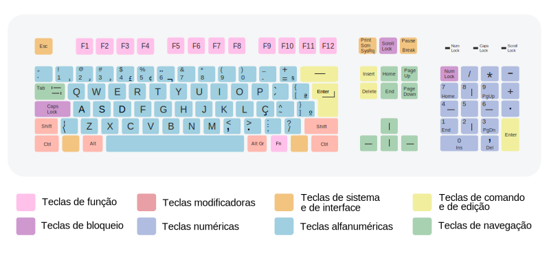

# Teclas de atalho

Tanto em sua máquina local quanto no terminal de um servidor remoto, as seguintes teclas de atalho serão bastante úteis:

| Tecla(s)        | Função                                             |
| --------------- | -------------------------------------------------- |
| `TAB`           | Autocompletar comandos e nomes de arquivos         |
| `CTRL+C`        | Cancelar um comando                                |
| `CTRL+D`        | Fim de arquivo. Substitui comando `exit`           |
| `CTRL+L`        | Limpa a tela. Substituiu comando `clear`           |
| `CTRL+R`        | Recordar ou recuperar comando já digitado          |
| `ALT+Backspace` | Apagar uma palavra à esquerda                      |
| `ALT+D`         | Apagar uma palavra à direita                       |
| `Home`          | Mover o `cursor` para o início da linha.           |
| `End`           | Mover o `cursor` para o final da linha.            |
| &uarr;          | Exibir comando anterior.                           |
| &darr;          | Exibir próximo comando.                            |
| &larr;          | Move o `cursor` um caracter à esquerda.            |
| &rarr;          | Move o `cursor` um caracter à direita.             |
| `Ctrl `&larr;   | Vai para o início da palavra atual ou da anterior. |
| `Ctrl `&rarr;   | Vai para o final da palavra atual ou da posterior. |

## Referência

- [The Best Keyboard Shortcuts for Bash (aka the Linux and macOS Terminal)](https://www.howtogeek.com/howto/ubuntu/keyboard-shortcuts-for-bash-command-shell-for-ubuntu-debian-suse-redhat-linux-etc/)

