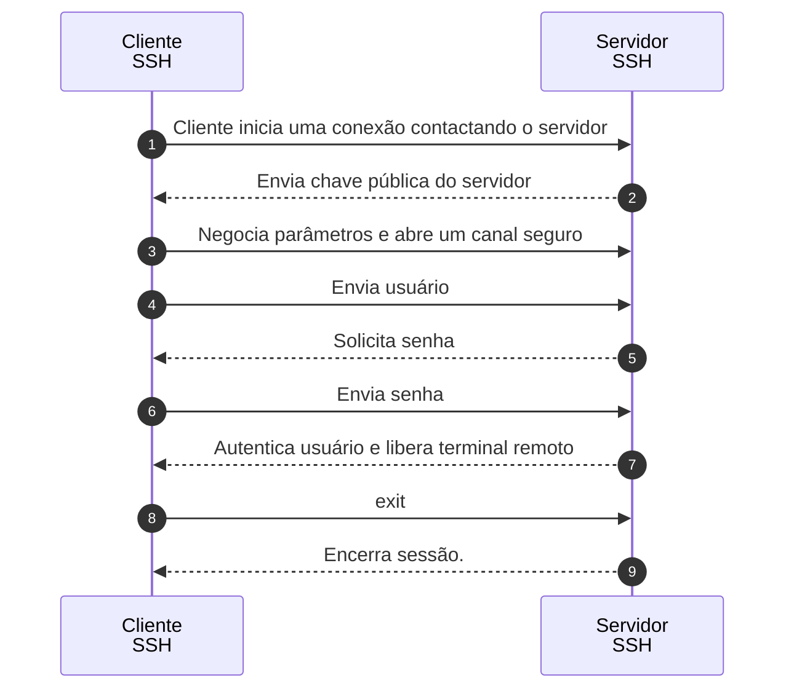

# exit

Saia da interpretador de comandos (*Shell*).

## Exemplos


Saida do comando: `tldr exit`


```
exit
Exit the shell.

 - Exit the shell with the exit code of the last command executed:
   exit

 - Exit the shell with the specified exit code:
   exit {{exit_code}}
```
## Diagrama de sequência


