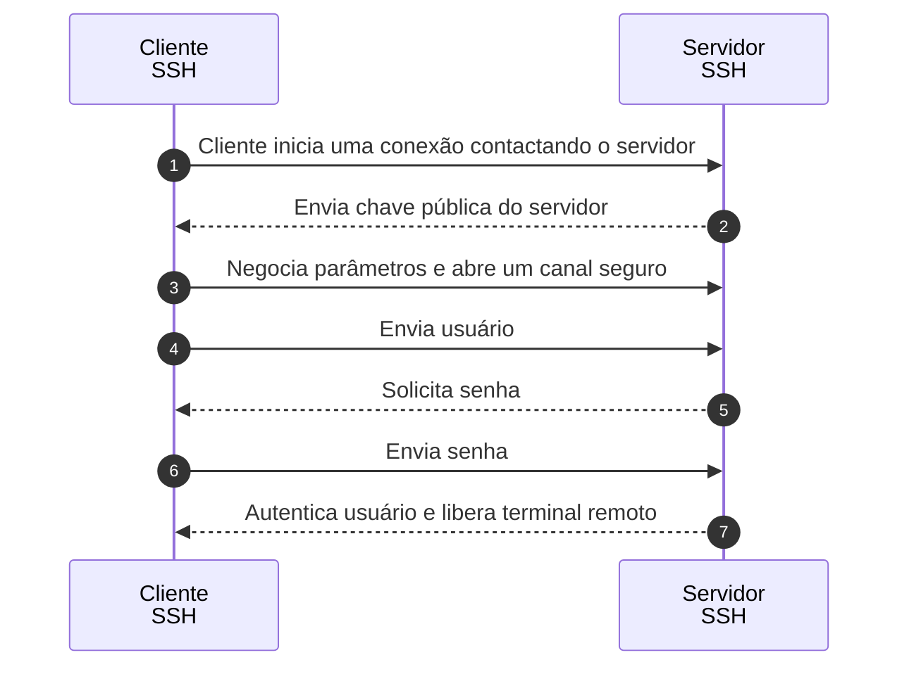

# ssh

O Secure Shell é um protocolo usado para efetuar login no sistema remoto. Pode ser usado para registrar ou executar comandos em um servidor remoto.

## Exemplos

Saida do comando: `tldr ssh`

```
ssh
Secure Shell is a protocol used to securely log onto remote systems.It can be used for logging or executing commands on a remote server.

 - Connect to a remote server:
   ssh {{username}}@{{remote_host}}

 - Run a command on a remote server:
   ssh {{remote_host}} {{command -with -flags}}

```

## Diagrama de sequência

