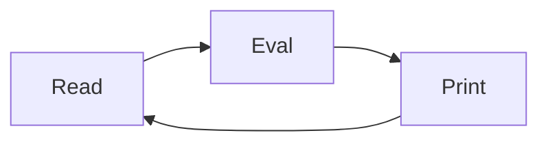
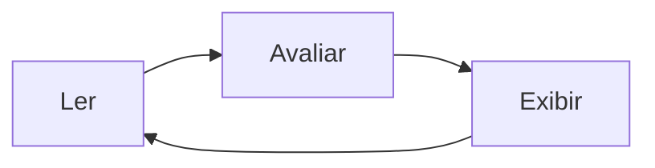

# Laço Ler-Avaliar-Exibir

O interpretador de comandos do terminal, também conhecido como *shell*, seguirá o laço Ler-Avaliar-Exibir (REPL, na sigla em inglês).

## Inglês

## Português

## Referência
- [Read–eval–print loop - Wikipedia](https://en.wikipedia.org/wiki/Read%E2%80%93eval%E2%80%93print_loop)
