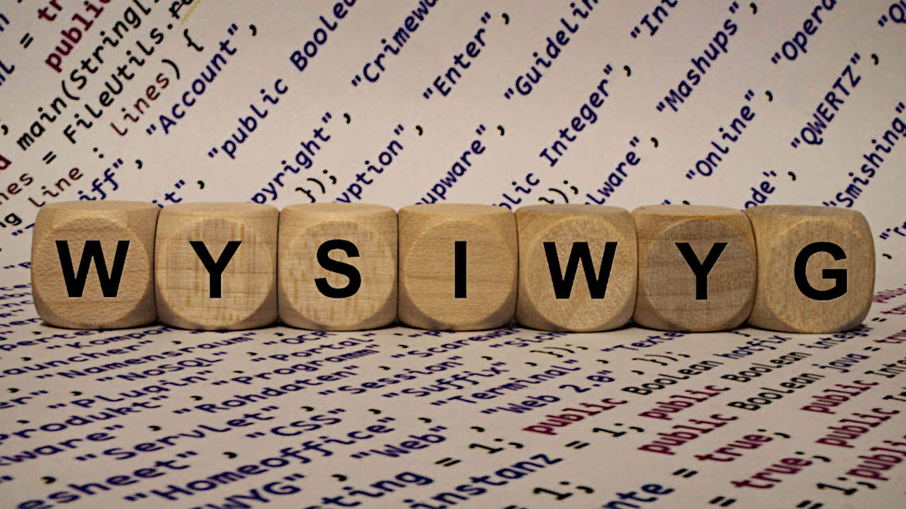

# WYSIWYG

O terminal não é uma interface gráfica, portanto, o que você vê não é o que você obtem (WYSIWYG, na sigla em inglês). Como desenvolvedor, é bom que você conheça também, pois ela lhe permitirá fazer algumas coisas que a interface gráfica não oferece. Interface gráfica com o usuário (GUI), interface de linha de comando (CLI) e interface para programação de aplicações (API) são coisas complementares. A aprendizagem de uma poderá lhe ajudar na compreensão de uma das outras.   

> A expressão WYSIWYG (lê-se “wiz-zee-wig”) é uma sigla para a expressão em inglês “What You See Is What You Get”, que em português significa “o que você vê é o que você recebe”. Ela é usada para identificar editores, geralmente de texto para a internet, que permite visualizar o resultado final de uma publicação ou impressão, em tempo real.

> O principal propósito de um editor web WYSIWYG é permitir que qualquer um possa usar editores e publicar conteúdo na internet, sem depender de conhecimentos em HTML para colocar uma página ou um blog no ar. Claro que domínios profissionais demandam maior conhecimento e contar com profissionais faz diferença, mas para quem deseja manter um blog simples sem gastar muito (ou nada), conhecimentos em programação são desnecessários.

## Exemplos de editores WYSIWYG

> Um dos exemplos de editor WYSIWYG mais conhecidos, que todo mundo já teve contato ao menos uma vez na vida, são os editores de texto, planilhas e apresentações que integram suítes de escritório, como o Microsoft Office (Word, Excel e PowerPoint), o Apple iWork (Pages, Numbers e Keynote) e o LibreOffice (Write, Calc e Impress), entre outras.

## Referências

- [O que é um editor WYSIWYG?](https://tecnoblog.net/responde/o-que-e-um-editor-wysiwyg/)
- [What You See Is All You Get from FOLDOC](https://foldoc.org/What+You+See+Is+All+You+Get)
